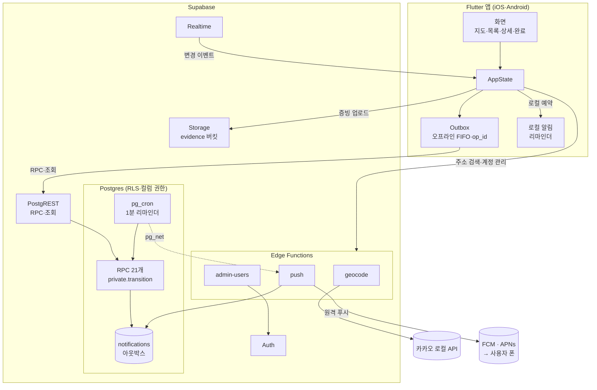
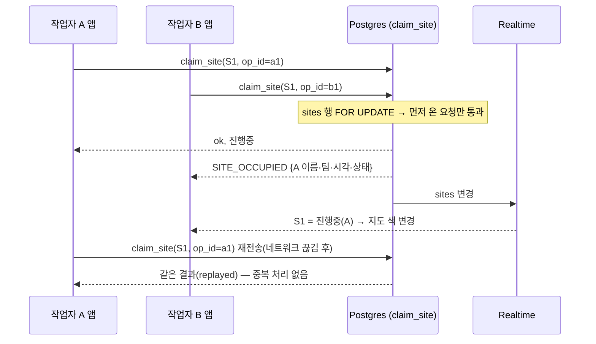

# FieldSync 개발 문서 (DEVELOPMENT.md)

> 대상: 이 저장소를 고치거나 확장하는 개발자 · 기준일 2026-09-23 · 설계 근거·대안 비교는 `GUIDE.md`, 배포·운영은 `RUNBOOK.md`, 사용법은 `USER_GUIDE.md`

## 1. 한눈에 보기

- **목적**: 여러 작업자가 같은 번지(상하수도 점검 현장)를 중복 작업하지 않도록, "누가·언제·어디를·어떤 상태로" 잡고 있는지 실시간으로 공유합니다.
- **구성**: Flutter 앱(iOS·Android) + Supabase(Postgres·Auth·Realtime·Storage·Edge Functions).
- **핵심 원칙**: 상태 변경은 서버 RPC 한 곳(`private.transition`)에서만 판정합니다. 앱은 표시·입력·오프라인 대기열만 담당합니다.

## 2. 아키텍처



동시 맡기 경쟁은 서버 한 곳에서 판정합니다(행 잠금 + 부분 유니크 인덱스).



## 3. 파일 구조

```
field-sync/
├── GUIDE.md                      설계 가이드(화면·스키마·API·권한·알림·로드맵·리스크)
├── DEVELOPMENT.md · RUNBOOK.md · USER_GUIDE.md
├── api/openapi.yaml              REST·RPC·Edge Function 명세(OpenAPI 3.1, 27 경로)
├── supabase/
│   ├── migrations/
│   │   ├── …001_schema.sql       테이블·타입·트리거·기본 데이터
│   │   ├── …002_api.sql          RPC(상태머신·긴급·배포·권한·통계·리마인더·푸시 선점)
│   │   ├── …003_security.sql     권한 회수 후 최소 부여 + RLS 정책
│   │   └── …004_platform.sql     Realtime 발행·Storage 버킷·pg_cron 작업
│   ├── functions/
│   │   ├── _shared/core.ts       공용(환경·응답·REST/Auth 최소 클라이언트·동시성 풀)
│   │   ├── geocode/              주소 검색·CSV 일괄 등록(카카오 키는 서버에만)
│   │   ├── admin-users/          계정 발급·비밀번호·활성/비활성(관리자 전용)
│   │   ├── push/                 알림 아웃박스 → FCM 발송(pg_cron 호출)
│   │   └── _tests/               단위(*.test.ts) · 통합(e2e.integration.ts) · smoke.sh
│   └── tests/                    로컬 PG 통합 테스트(run.sh가 00~90 순서 실행)
└── app/
    ├── pubspec.yaml · analysis_options.yaml · env.example.json · .gitignore
    ├── lib/
    │   ├── main.dart · config.dart     초기화 · --dart-define 설정
    │   ├── core/                       i18n(ko/en/vi) · theme(상태 색) · util(순수 함수)
    │   ├── data/                       models · api(Supabase 호출·오류 분류) · outbox(오프라인 대기열)
    │   ├── services/                   notif(로컬·FCM 알림) · location(도착 감지)
    │   ├── state/app_state.dart        전역 상태·실시간 구독·낙관적 반영
    │   └── ui/                         화면(작업자) · ui/admin(관리)
    ├── test/                           단위·위젯 테스트 + fixtures/check_parity.json
    ├── tool/xref_check.py              앱↔서버 교차 검사(Flutter 불필요)
    └── platform/                       flutter create 후 병합할 Android·iOS 설정 조각
```

## 4. 개발 환경과 명령

| 목적 | 요구 | 명령(저장소 루트 기준) | 기대 결과 |
|---|---|---|---|
| DB 통합 테스트 | PostgreSQL 14+ 서버 바이너리 | `bash supabase/tests/run.sh` | `합계: PASS 277 · 실패 파일 0` |
| + HTTP 통합(PostgREST) | postgrest 12+, node 22.18+ | `POSTGREST=/path/to/postgrest bash supabase/tests/run.sh` | `합계: PASS 342 · 실패 파일 0` |
| Edge 단위·문서 테스트 | node 22.18+ (또는 deno 2: `deno test --allow-env --allow-read supabase/functions/_tests/`) | `node --test supabase/functions/_tests/*.test.ts` | `# pass 42`, `# fail 0` |
| Edge 정적 검사 | deno 2 | `cd supabase/functions && deno lint && deno check */index.ts && deno fmt --check --single-quote --line-width=120` | 오류 0 |
| 앱↔서버 교차 검사 | python 3.9+ | `python3 app/tool/xref_check.py` | `결과: 오류 0건` |
| OpenAPI 검증 | `pip install openapi-spec-validator` | `openapi-spec-validator api/openapi.yaml` | `OK` |
| 앱 준비 | Flutter 3.38.1+ | `cd app && flutter create --platforms android,ios --org <도메인> . && rm test/widget_test.dart` | android/ios 폴더 생성 |
| 앱 정적 분석·테스트 | 〃 | `flutter pub get && flutter analyze && flutter test` | 테스트 73개 통과(파라미터화 포함) — **확인 필요**(작성 환경에 Flutter 없음) |
| 앱 실행 | 〃 + env.json | `cp env.example.json env.json` (값 입력) → `flutter run --dart-define-from-file=env.json` | 로그인 화면 |

- `flutter create`는 기존 파일을 덮어쓰지 않습니다. 자동 생성되는 `test/widget_test.dart`는 없는 `MyApp`을 참조하므로 삭제해야 합니다.
- 플랫폼 설정은 `app/platform/`의 조각을 병합합니다. 각 파일 첫머리 주석에 병합 위치와 근거가 적혀 있습니다.
- `bench.sql`(성능)과 `smoke.sh`(Deno 실제 런타임)는 선택 실행입니다. 실행 방법은 각 파일 첫머리 주석을 보세요.

## 5. 의존성 (최소화 · 이유 1줄)

앱(`app/pubspec.yaml`, 11개):

| 패키지 | 이유 |
|---|---|
| supabase_flutter | Auth·DB·Realtime·Storage·Functions를 클라이언트 하나로 처리 |
| kakao_map_sdk | 카카오맵 네이티브 SDK v2 래퍼(지도·마커) |
| firebase_core · firebase_messaging | 원격 푸시(긴급·에스컬레이션·강제 해제) |
| flutter_local_notifications | 오프라인에서도 울리는 리마인더, Android 상시 "작업중" 알림 |
| timezone | `zonedSchedule`의 필수 타입(UTC만 사용, tz DB 미로딩) |
| geolocator | 현장 도착 감지·가까운 순 정렬 |
| url_launcher | 카카오맵 앱 길찾기·즐겨찾기 링크 열기 |
| image_picker | 증빙 사진 촬영 |
| file_picker | 관리자 CSV 파일 선택 |
| path_provider | 오프라인 대기열·캐시·미전송 사진 보관 폴더 |

- 서버에는 외부 패키지가 없습니다. SQL은 표준 PL/pgSQL, Edge Function은 Web 표준 API(fetch·crypto)만 씁니다.
- 상태관리·JSON 직렬화·UUID·다국어는 패키지 없이 직접 구현했습니다(`AppScope`, `fromJson`, `uuidV4`, `tr`).
- 개발 도구(배포물에는 포함 안 됨): postgrest 12(HTTP 통합), deno 2·node 22(Edge 테스트), openapi-spec-validator, mermaid-cli(문서 도표 확인).

## 6. 반드시 지킬 규칙 (불변식)

| # | 규칙 | 지키는 곳 | 어기면 |
|---|---|---|---|
| I1 | 작업 상태 변경은 RPC만 사용. `sites.status`·점유 컬럼은 컬럼 권한으로 직접 수정 불가 | `private.transition`, `…003_security.sql` | 중복 점유·로그 누락 |
| I2 | 모든 변경 요청에 `p_op_id`(uuid) 포함 → 재전송해도 결과 1번 | `private.replay/finish`, `AppState._op` | 오프라인 재전송 시 이중 처리 |
| I3 | 권한 판정은 서버(`private.can`, RLS). 앱의 버튼 숨김은 편의일 뿐 | RPC·RLS | 권한 우회 |
| I4 | 체크 항목 검증 규칙은 앱=서버 | `CheckItem.valid` ↔ `private.valid_check_value`, 공유 표 `app/test/fixtures/check_parity.json` | 앱은 제출 가능한데 서버가 거절 |
| I5 | 새 문구는 ko·en·vi 세 언어에 같은 키, 같은 `{자리표시자}`로 추가 | `lib/core/i18n.dart`, `xref_check.py` | 중복 키는 컴파일 오류, 누락 키는 한국어(없으면 키 자체)로 표시 — 검사기가 둘 다 잡음 |
| I6 | 비밀은 환경변수·Vault에만 둠. 앱에는 공개용 publishable 키만 | `config.dart`, Edge `requireEnv`, Vault | 키 유출 |
| I7 | 로그에 개인정보 금지. Edge는 내부 오류 상세를 응답에 넣지 않음, 앱은 `print` 금지(lint) | `errorResponse`, `analysis_options.yaml` | 개인정보 노출 |
| I8 | 시간은 UTC로 저장하고 통계 날짜는 Asia/Seoul 기준 | `get_stats`, 앱 `toUtc()` | 날짜 경계 오류 |

## 7. 변경 레시피

- **RPC 추가·변경**
  1. `…002_api.sql`에 추가합니다. 변경 RPC는 `p_op_id`를 받고 `private.finish`로 로그·멱등을 처리합니다.
  2. 권한을 명시합니다. Supabase 기본 설정은 새 함수·테이블에 anon·authenticated 권한을 자동으로 주고, `…003`의 회수는 그 시점에 있던 객체에만 적용됩니다. 그래서 새 마이그레이션마다 `revoke … from anon`을 넣고, 서버 전용 함수는 authenticated에서도 회수합니다. 새 테이블에는 RLS를 켜고 필요한 권한만 부여합니다.
  3. `api/openapi.yaml`에 경로를 추가합니다.
  4. `supabase/tests/`에 정상·경계·오류 사례를 추가합니다.
  5. 앱에서 호출합니다(`api.rpc` 또는 `AppState._act`).
  6. `python3 app/tool/xref_check.py`를 실행합니다. 인자명이 시그니처와 다르면 PostgREST가 404 `PGRST202`를 반환하므로, 검사기가 이를 미리 잡습니다.
- **결과 코드 추가**: SQL `v_code`, 앱 i18n `code.<CODE>` 세 언어, 필요하면 `AppState.rejectText`를 함께 고칩니다. 검사기가 누락을 잡습니다.
- **권한 키 추가**: `private.delegable_perms()`, `perms_page.dart`의 `perms`, i18n `perm.<키>`를 함께 고칩니다.
- **정책 항목 추가**
  1. DB: `settings` 컬럼과 CHECK, `update_settings`
  2. 앱: `Settings` getter, `policy_page._fields`, i18n `policy.*`
  3. 문서: `USER_GUIDE.md` §8의 기본값 표(검사기가 SQL 기본값과 비교합니다)
- **체크 검증 규칙 변경**
  1. SQL `valid_check_value`와 `models.dart`의 `CheckItem.valid`를 함께 고칩니다.
  2. 사례를 추가한 `check_parity.json`을 서버 결과로 다시 만들고, `80_check_parity.sh`와 `flutter test`를 둘 다 통과시킵니다.
- **마이그레이션**: 운영에 적용한 파일은 수정하지 않고 새 파일(`2026MMDD…_*.sql`)을 추가합니다. 1~4단계 파일은 아직 운영에 적용되지 않은 초기본입니다.

## 8. 테스트 구성

| 수준 | 위치 | 개수(측정) | 무엇을 보장하나 |
|---|---|---|---|
| DB 정상·경계·오류·빈 값 | `supabase/tests/10~40_*.sql` | 162 | 상태머신·입력 검증·코드 |
| RLS·권한 | `50_rls.sql` | 39 | 행·컬럼 권한, 자가 가입 계정 비활성, 배포된 동선은 관리자만 수정 |
| 리마인더·통계·푸시 선점 | `60_reminders_stats.sql` | 46 | 스케줄·에스컬레이션·SKIP LOCKED |
| 동시성 | `70_concurrency.sh` | 13 | 동시 맡기 1명만 성공, 1인 한도 |
| 앱↔서버 체크 규칙 | `80_check_parity.sh` | 17 | 공유 표를 서버 함수로 확인 |
| HTTP 통합(앱 요청) | `90_http_e2e.py` | 58 | 실제 PostgREST: RPC 인자·임베드 조회·컬럼 권한·RLS·멱등 |
| HTTP 통합(Edge) | `functions/_tests/e2e.integration.ts` | 7 | geocode·admin-users·push → 실제 DB(외부 API만 가짜) |
| Edge 단위 | `functions/_tests/*.test.ts` | 40 | 파싱·서명·재시도·오류 응답 |
| 문서 예시 | `functions/_tests/docs.test.ts` | 2 | USER_GUIDE의 CSV 예시·열 제목을 실제 파서로 확인 |
| 앱 단위·위젯 | `app/test/*.dart` | 73 | util·모델·대기열·i18n·상태 칩·대비율 — **실행 확인 필요** |
| 정적 교차 검사 | `app/tool/xref_check.py` | 결함 22종 주입 시 모두 검출 | i18n·RPC 인자·컬럼 권한·import·채널·기본값·문서(화면 이름·정책값·상태 색·경로) |

## 9. 성능 (측정값)

측정 환경: 로컬 PostgreSQL 16, 현장 1만 곳·사용자 500명 합성 데이터(`bench.sql`, 전부 롤백). 운영 네트워크 지연은 포함하지 않습니다.

| 작업 | 결과 |
|---|---|
| `claim_site` 500건 순차 | 308 ms (평균 0.62 ms/건) |
| 중복 맡기 거절 500건 | 611 ms (평균 1.22 ms/건, 거절 로그 기록 포함) |
| `run_reminders` 506건 | 90 ms (pg_cron 1분 주기 대비 여유) |
| `get_stats`(사람별) | 32 ms |

앱 쪽 수치(마커 수백 개 렌더링, 배터리)는 실기기 측정이 필요합니다(**확인 필요**).

## 10. 복잡도 (핫패스)

| 위치 | 복잡도 | 비고 |
|---|---|---|
| `private.transition` | 인덱스 조회 O(log n) 몇 회 | 현장 행 → 사용자 행 순서로 잠가 교착 방지 |
| `private.missing_checks` | O(항목 수) | 앱 `Template.missing`도 동일 |
| `private.run_reminders` | O(k log n), k=도래 세션 | `FOR UPDATE SKIP LOCKED` |
| `claim_push_batch` | O(k log n) | 2분 임대, 최대 5회 |
| Edge `parseCsv` / `parseSiteRows` | O(문자 수) / O(행×열) | 최대 1,000행 |
| Edge push 발송 | O(알림×기기), 동시 10 | |
| 앱 `nearestOrder` | O(n²) | n=300이면 9만 회(수 ms, 추정) |
| 앱 `Outbox.flush` | O(대기 건수) | FIFO, 실패 시 5→60초 백오프 |
| 앱 지도 마커 동기화 | O(현장 수) 비교 후 바뀐 것만 반영 | 작업중 마커만 깜빡임(최대 50개) |

## 11. 오류 처리 원칙

- **업무 거절은 HTTP 200 + `{ok:false, code}`로 옵니다.** 앱은 `code.*` 문구를 표시하고, 거절된 시도도 `work_logs.ok=false`로 남습니다.
- **앱의 재시도 분류**(`api.dart guard`, PostgREST 12.2.12로 측정):
  - DB 중단 직후 첫 응답은 HTTP 400 + 빈 code, 이후 503 `PGRST001`입니다. 둘 다 재시도합니다.
  - statement timeout은 500 `57014`이며 재시도합니다.
  - `PGRST00x`, `PGRST301`·`PGRST303`(토큰 만료, 자동 갱신 후 재시도), `08*`, `40*`, `5*`, 빈 code도 재시도 대상입니다.
  - 그 밖의 오류(권한 42501, 입력 22023, 404 `PGRST202` 등)는 해당 요청만 대기열에서 제거하고 사용자에게 알립니다.
- **증빙 재전송**: Storage 409, `attachments` 23505는 이미 처리된 것으로 보고 성공으로 간주합니다.
- **Edge Function**: `{code, message}`와 적절한 HTTP 상태를 반환합니다. 내부 오류 상세는 서버 로그에만 남깁니다.

## 12. 알려진 제약 · 확인 필요

- **확인 필요**: Flutter 앱은 작성 환경에 SDK가 없어 `flutter analyze`·`flutter test`와 실기기 동작을 확인하지 못했습니다. 정적 검사, 외부 API 원본 대조, 별도 코드 리뷰로 대신했습니다.
- **확인 필요**: `ReorderableListView.onReorder`의 최신 Flutter deprecated 여부(info 수준).
- 사진 워터마크 합성은 하지 않습니다. 사진을 추가한 시각·위치를 메타데이터로 저장하고(EXIF 미사용), 로그에 "현장에서 떨어진 위치" 표시로 대신합니다.
- 앱에는 증빙 보기 화면이 없습니다(Dashboard → Storage에서 확인). 앱 내 보기는 로드맵입니다.
- 오프라인 맡기는 중복을 완전히 막을 수 없습니다. 경고 후 진행하며, 서버에 먼저 도착한 요청이 이깁니다.
- 음성 메모, 백그라운드 지오펜스, iOS Live Activity, 관리자 웹, .xlsx 직접 업로드는 로드맵입니다(`GUIDE.md` §8).
- 베트남어 문구는 원어민 검수가 필요합니다.
