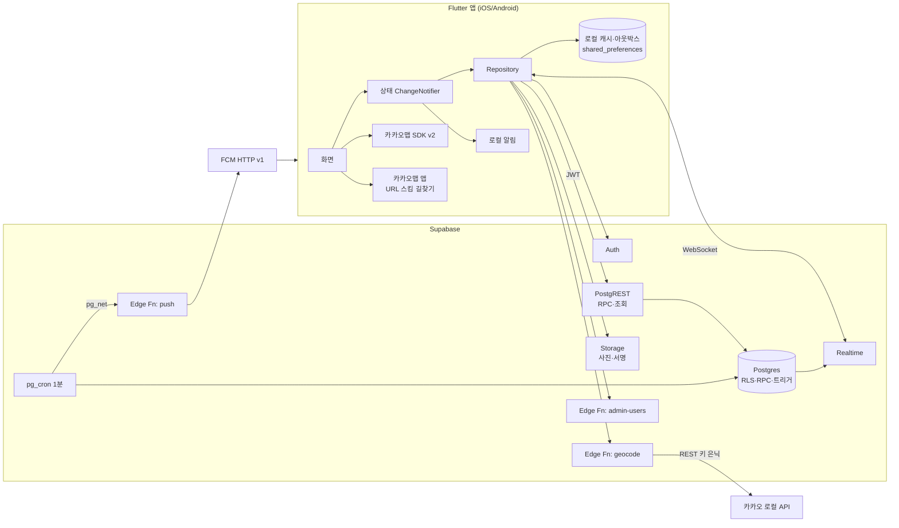
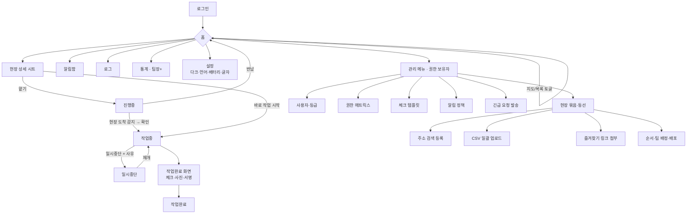
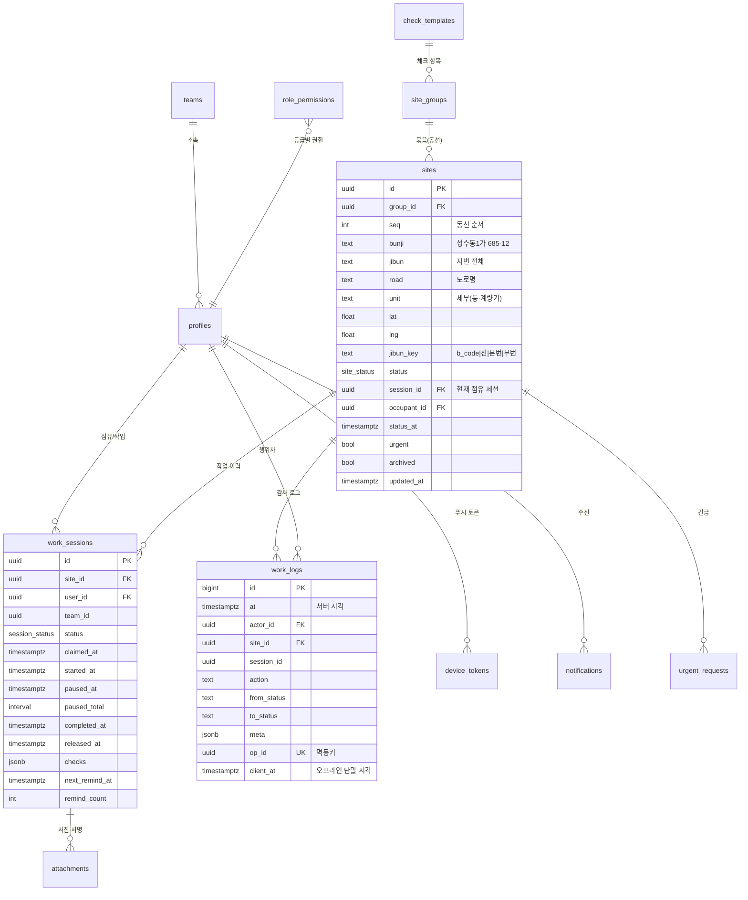
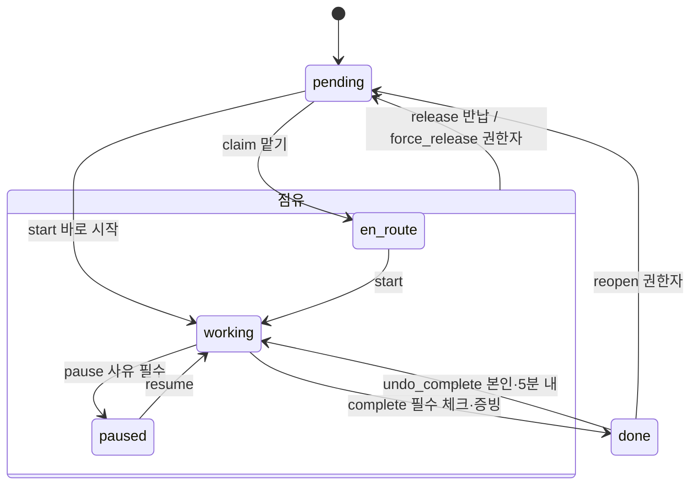
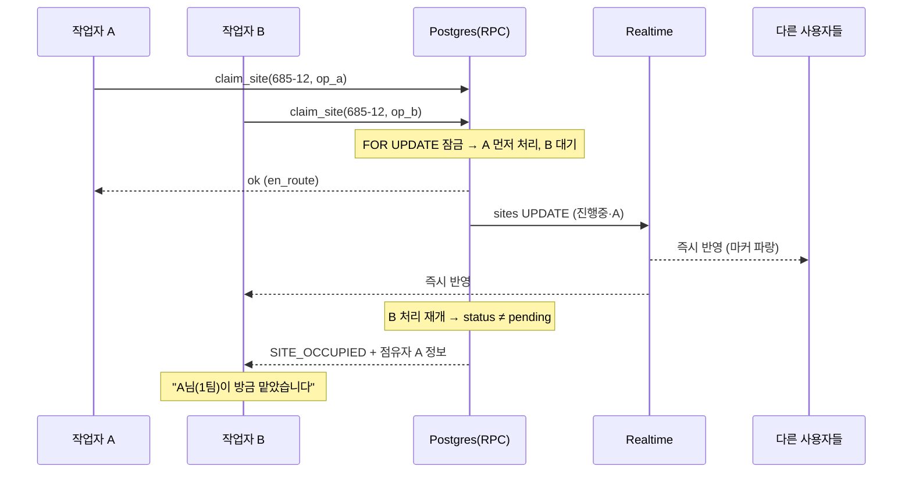
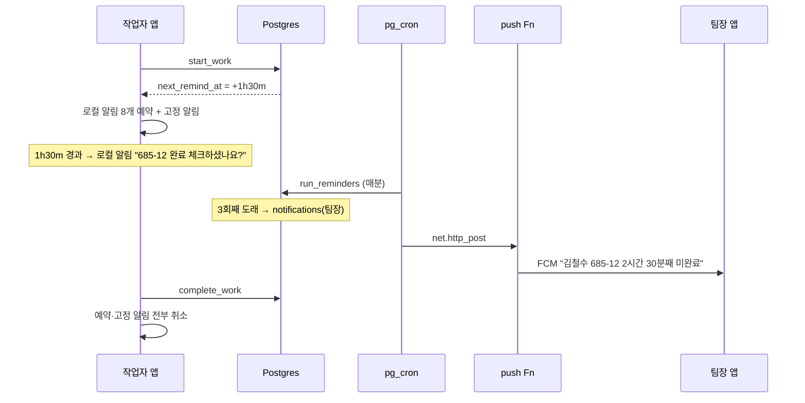

# FieldSync — 현장 작업 중복 방지 협업 앱 설계 가이드

> 버전 0.5 (5단계 통합 점검 반영: 배포 후 수정 관리자 고정·자가 가입 계정 비활성·재오픈 즉시 푸시) · 스택: Flutter + Supabase · 대상: iOS 14+ / Android 7.0(API 24)+ (file_picker 13·flutter_local_notifications 21+ 요구)

## 0. 결론 요약

| 항목 | 결정 |
|---|---|
| 중복 방지의 핵심 | **DB 부분 유니크 인덱스**(`site_id`당 점유 세션 1개) + **원자적 RPC**. 클라이언트 판단에 의존하지 않음 |
| 실시간 반영 | Supabase Realtime(`postgres_changes`)로 `sites` 변경을 모든 사용자에게 푸시, 재연결 시 `updated_at` 기준 델타 재조회 |
| 권한 | 등급(관리자/팀장/작업자) × 권한키 매트릭스. **배포(주소·동선 전달)·등급 부여는 관리자 고정** |
| 알림 | 작업자 리마인더 = **로컬 알림**(오프라인에서도 동작), 팀장 에스컬레이션·긴급 = **FCM 푸시**, 스케줄 원본 = 서버(`next_remind_at`) |
| 오프라인 | 로컬 캐시 + 아웃박스(멱등 `op_id`) → 복구 시 순차 재전송, 충돌 시 **서버 선착순 우선** |
| 카카오맵 즐겨찾기 | **API 미제공**(카카오 공식 답변) → 앱 내 등록(주소검색/CSV)이 원본, 즐겨찾기 폴더 공유링크는 참고 첨부 |

### 0.1 전제·가정 (변경 시 알려주세요)

| # | 가정 | 근거/영향 |
|---|---|---|
| A1 | 1개 Supabase 프로젝트 = 1개 회사 (멀티테넌트 아님) | RLS 단순화. 다회사 필요 시 `org_id` 추가(확장 포인트) |
| A2 | 상태 5종: 대기중 → 진행중(담당확정·이동/도착) → 작업중 ⇄ 일시중단 → 작업완료 | 사용자 확정(1번안 + 일시중단) |
| A3 | 진행중·작업중·일시중단 = **점유** 상태 (타인 점유 불가) | 일시중단 중 타인이 가져가면 중복 발생하므로 점유 유지, 팀장이 해제 가능 |
| A4 | 기본 언어 한국어 + 영어 + 베트남어 | 외국인 작업자 비중 확인 필요 |
| A5 | 운영 시간대 Asia/Seoul, 서버 시각이 기록의 기준 | 단말 시각 조작 방지 |
| A6 | 상하수도 체크 항목은 **템플릿으로 관리자 편집** (예시 제공) | 실제 항목은 확인 필요 |
| A7 | 로그인 = 관리자가 발급한 ID/비밀번호 (자가 가입 없음) | Supabase Auth는 이메일 필수 → `{id}@staff.fieldsync.local` 가상 이메일 사용(확인 필요) |

---

## 1. 아키텍처



### 1.1 기술 선택 근거

| 선택 | 이유 | 트레이드오프 |
|---|---|---|
| Flutter | 단일 코드베이스, 네이티브 카카오맵 래퍼(`kakao_map_sdk`) 활발히 유지(1.3.1, 2026-09-12) | 카카오 공식 패키지 아님 → SDK 변경 시 래퍼 대응 지연 가능 |
| Supabase | Postgres 트랜잭션·제약으로 중복 방지를 **DB가 보장**, RLS로 권한, SQL로 로그·통계 | 오프라인 동기화 미내장 → 아웃박스 직접 구현(약 150줄 추정) |
| 상태관리 = SDK 내장 `ChangeNotifier` | 외부 상태관리 패키지 0개 | 화면 30개 이상으로 커지면 구조화 부족 → 그때 도입 검토 |
| 다국어 = 문자열 맵 직접 구현 | `intl`/코드생성 불필요 | 복수형·날짜 포맷 수동 처리 |

### 1.2 의존성 (앱)

| 이름 | 목적(왜 필요한가) | 대안 | 크기/영향 |
|---|---|---|---|
| supabase_flutter | Auth·DB·Realtime·Storage·Functions 단일 클라이언트 | 개별 HTTP 구현(코드 대폭 증가) | 순수 Dart, 영향 작음(추정) |
| kakao_map_sdk | 카카오맵 네이티브 지도·마커·LOD 대량 마커 | WebView+JS API(무겁고 느림) | 네이티브 SDK 포함, 수 MB 증가(확인 필요) |
| firebase_core, firebase_messaging | 원격 푸시(긴급·에스컬레이션) — APNs/FCM 통합 | APNs+FCM 직접 연동(복잡) | 네이티브 Firebase 라이브러리 포함 |
| flutter_local_notifications | 오프라인에서도 동작하는 리마인더·상시 작업중 알림 | 없음(플랫폼 채널 직접 구현) | 작음 |
| timezone | `zonedSchedule` 필수 파라미터(UTC만 사용, tz DB 로딩 생략) | — | 작음 |
| geolocator | 현장 도착 감지·거리순 정렬 | 플랫폼 채널 직접 구현 | 작음 |
| url_launcher | 카카오맵 앱 길찾기·즐겨찾기 링크 열기 | — | 작음 |
| image_picker | 사진 증빙 촬영 | camera(무거움) | 작음 |
| file_picker | 관리자 CSV 선택 | CSV 텍스트 붙여넣기(불편) | 작음 |

직접 구현(의존성 0): 서명 패드(`CustomPainter`), 사진 워터마크(`dart:ui` Canvas), 통계 막대(`Container`), 거리 계산(Haversine), 동선 정렬(최근접 이웃).

---

## 2. 화면 설계

### 2.1 UI 흐름



### 2.2 상태 표기 규칙 (색 + 텍스트 + 아이콘 + 움직임 4중 구분)

| 상태 | 텍스트 | 색(배경/글자) | 아이콘 | 움직임 | 점유 |
|---|---|---|---|---|---|
| pending | 대기중 | `#616161` / 흰색 | ○ | 없음 | ✖ |
| en_route | 진행중 | `#1565C0` / 흰색 | ➜ | 없음 | ✔ |
| working | **작업중** | `#C62828` / 흰색 | 🔧 | **1Hz 페이드 깜빡임** | ✔ |
| paused | 일시중단 | `#F9A825` / 검정 | ⏸ | 사선 패턴 | ✔ |
| done | **작업완료** | `#2E7D32` / 흰색 | ✓ | 없음 | ✖ |

- 글자 대비율 5.1~10.7:1 → WCAG AA(4.5:1) 전 상태 통과 (계산 검증).
- 적록색약 대비: 작업중(빨강)·작업완료(초록)는 **아이콘·깜빡임·텍스트**로도 구분.
- 깜빡임은 초당 3회 미만(WCAG 2.3.1 광과민 기준) → 1Hz 페이드. 배터리 절약·동작 줄이기 설정 시 정지.
- **내 점유 현장**은 두꺼운 테두리 + "내 작업" 뱃지.

### 2.3 화면별 와이어프레임

**① 홈(지도)** — 하단 "현재 작업 바"는 작업중일 때 항상 고정 (완료 체크 유도)

```text
┌─────────────────────────────────────┐
│ ☰  9/23 성수 1구역 ▼        🔔2  ⚙  │
│ ⚠ 오프라인 · 전송 대기 3건            │ ← 조건부
│ 🚨 긴급: 성수동1가 685-12 누수 [보기] │ ← 조건부
│ (전체)(대기12)(진행3)(작업중5)(중단1) │
│ (완료20)(내 작업)                     │ ← 필터 칩, 개수 실시간
│                                     │
│           [ 카카오맵 ]               │
│   ○대기  ➜진행중  🔧작업중(깜빡)  ✓완료 │
│                                     │
│                   [◎ 내 위치] [≡ 목록]│
├─────────────────────────────────────┤
│ 🔧 작업중 · 685-12 · 01:12:30         │
│ [ 일시중단 ]          [ 작업완료 ✓ ]  │ ← 56dp 이상 큰 버튼
└─────────────────────────────────────┘
```

**② 홈(목록)** — 기본 정렬: 내 작업 → 가까운 대기 현장 순

```text
│ 🔧 작업중  │ 성수동1가 685-12 [📋] │ 김철수·1팀 09:12~ (1h12m) │
│ ➜ 진행중  │ 성수동1가 690-1  [📋] │ 이영희·2팀 10:02~           │
│ ○ 대기중  │ 성수동1가 686-3  [📋] │ 320m          [ 맡기 ]     │
│ ✓ 작업완료 │ 성수동1가 684-7  [📋] │ 박민수 08:10~09:05 (55m)   │
```

**③ 현장 상세 (하단 시트)** — 상태별로 주 버튼 1개 + 보조 1개만 노출

```text
┌─────────────────────────────────────┐
│ 성수동1가 685-12              [📋]  │ ← 한 번 탭 = 복사 + 진동 + "복사됨"
│ 서울 성동구 아차산로 17        [📋]  │
│ 세부: B동 계량기#2 · 메모: 대문 비번 │
│ ┌─────────────────────────────────┐ │
│ │ 🔧 작업중  김철수 · 1팀 · 09:12~ │ │ ← 깜빡
│ └─────────────────────────────────┘ │
│ 상수도  ☐계량기 확인 ☐누수 ☐지침     │
│ 하수도  ☐맨홀 상태 ☐역류 ☐악취       │
│ [🧭 길찾기]   [🗺 카카오맵에서 보기]  │
│ [          맡기 (진행중)          ] │ ← 주 버튼
│ 기록: 09:12 김철수 작업시작 · 09:05 … │ ← 로그 조회 권한 범위만 표시
└─────────────────────────────────────┘
```

| 현재 상태 | 내가 점유자 | 주 버튼 | 보조 버튼 |
|---|---|---|---|
| 대기중 | — | 맡기(진행중) | 바로 작업 시작 |
| 진행중 | ✔ | 작업 시작 | 반납 |
| 작업중 | ✔ | 작업완료 | 일시중단 |
| 일시중단 | ✔ | 재개 | 반납 |
| 점유 상태 | ✖ | (비활성) "김철수 작업중" | 강제 해제(권한자만) |
| 작업완료 | — | (없음) | 재오픈(권한자만) |

**④ 작업완료 화면**

```text
│ ←  작업완료 · 685-12                  │
│ 상수도                                │
│   계량기 지침  [  1234 ] m³   *필수    │
│   누수 여부   (없음)(있음)             │
│ 하수도                                │
│   맨홀 상태   (양호)(파손)(막힘)        │
│ 메모 [                            ]   │
│ 사진 *최소 1장  [＋] [🖼] [🖼]          │ ← 시간·주소 워터마크 자동
│ 서명 [          서명 패드          ]   │
│ [          작업완료 제출 ✓         ]   │ ← 필수 미입력 시 비활성 + 누락 항목 표시
```

**⑤ 로그** — 필터: 기간 · 팀 · 사람 · 현장 · 행동

```text
│ 09:41 김철수(1팀)  성수동1가 685-12  작업완료 (55m)     │
│ 09:12 김철수(1팀)  성수동1가 685-12  작업시작           │
│ 08:58 이영희(2팀)  성수동1가 690-1   맡기               │
│ 08:30 관리자       9/23 성수 1구역   배포 (현장 40곳)    │
```

**⑥ 관리: 권한 매트릭스** (관리자 전용)

```text
│ 권한                 관리자    팀장    작업자 │
│ 현장 등록             ✔고정    [ON]    [OFF] │
│ 현장 수정             ✔고정    [ON]    [OFF] │
│ 강제 해제(팀 범위)     ✔고정    [ON]    [OFF] │
│ 재오픈               ✔고정    [ON]    [OFF] │
│ 긴급 요청 발송         ✔고정    [ON]    [OFF] │
│ 팀 로그·통계 조회      ✔고정    [ON]    [OFF] │
│ 체크 템플릿 편집       ✔고정    [OFF]   [OFF] │
│ 배포(주소·동선 전달)   ✔고정     ✖       ✖   │ ← 위임 불가
│ 등급·권한 부여         ✔고정     ✖       ✖   │ ← 위임 불가
```

**⑦ 관리: 현장 묶음(동선) 편집**

```text
│ 9/23 성수 1구역            [배포 OFF ⇄ ON] │
│ 배정 팀: [1팀 ▼]   체크 템플릿: [상하수도 기본 ▼] │
│ 카카오맵 즐겨찾기 링크: [https://kko.to/…] [열기] │
│ [🔍 주소 검색 추가]  [📄 CSV 업로드]            │
│ ≡ 1. 성수동1가 685-12   B동 계량기#2    [✎][🗑] │ ← 드래그로 순서(동선)
│ ≡ 2. 성수동1가 686-3                   [✎][🗑] │
│ CSV 결과: 성공 38 · 실패 2 [실패 목록 보기]      │
```

### 2.4 현장 편의 UX 원칙

| 원칙 | 적용 |
|---|---|
| 한 손·장갑 조작 | 주 버튼 하단 배치, 최소 56dp, 간격 8dp 이상 |
| 3탭 이내 | 맡기 1탭 · 작업시작 1탭 · 완료 = 체크 입력 + 제출 |
| 되돌리기 | 잘못 누름 대비: "맡기" → 스낵바 [반납], "작업완료" → **5분 내 본인 취소**(작업중 복귀) |
| 즉시 피드백 | 버튼 탭 → 진동 + 처리중 표시, 실패 사유를 사람 말로 ("이미 김철수님이 09:12부터 작업중") |
| 시인성 | 다크 모드(야간), **야외 고대비 모드**(직사광선), 큰 글씨 3단계 |
| 복사 | 주소 한 번 탭 = 복사, 길게 누르면 도로명/지번/세부 선택 |

**⑧ 통계** (팀장: 자기 팀 / 관리자: 전체) — 차트 라이브러리 없이 막대 위젯

```text
│ 기간 [오늘 ▼]   기준 (팀)(개인)                        │
│ 1팀  ██████████████░░░░  완료 28/35 (80%) 평균 42분    │
│ 2팀  ████████░░░░░░░░░░  완료 15/33 (45%) 평균 57분    │
│ 차단된 중복 시도 7건 · 장기 미완료 2건 [목록]            │
```

### 2.5 길찾기 · 동선 · 반자동 체크인

| 기능 | 방식 | 비용·제약 |
|---|---|---|
| 길찾기 | `kakaomap://route?sp={내위치}&ep={현장}&by=car` → 앱 미설치 시 `https://map.kakao.com/link/to/{이름},{lat},{lng}` | 외부 앱 전환 |
| 다음 현장 추천 | 남은 대기 현장을 **최근접 이웃**으로 정렬(Haversine) | O(n²), n ≤ 300 → 9만 회 연산, 수 ms(추정) |
| 동선 순서 | 관리자가 정한 `seq` 우선, 작업자는 "가까운 순" 토글 | 2-opt 개선은 로드맵 |
| 현장 도착 감지 | 앱 사용 중에만 위치 확인(거리 20m 이동마다), 반경 50m 진입 시 확인창 | 백그라운드 지오펜스는 로드맵(항상 허용 권한·스토어 심사 부담) |
| 도착 확인창 | 미점유 현장: "이 현장을 맡을까요?(진행중)" / 내 진행중 현장: "작업을 시작할까요?(작업중)" | **자동 전환 없음**(오전환 방지) |

### 2.6 다크 모드 · 다국어 · 배터리 절약

| 기능 | 구현 |
|---|---|
| 테마 | 시스템 / 라이트 / 다크 / 야외 고대비. 상태 색은 테마와 무관하게 고정(식별성 유지) |
| 다국어 | 한국어·영어·베트남어 문자열 맵, 로그인 화면에서 즉시 전환, 주소는 원문 유지 |
| 배터리 절약 | ① 위치 확인 끔(수동 체크인) ② 깜빡임 정지(아이콘·텍스트 유지) ③ 다크 테마 강제 ④ 백그라운드 시 실시간 구독 해제 → 복귀 시 델타 조회 ⑤ 지도 내 위치 추적 끔 |
| 큰 글씨 | 3단계(기본/크게/아주 크게), 시스템 글꼴 크기 반영 |

---

## 3. 데이터 구조 (DB 스키마)

### 3.1 ERD



### 3.2 테이블 명세

| 테이블 | 핵심 컬럼 | 제약·인덱스 | 비고 |
|---|---|---|---|
| `profiles` | id(=auth.users.id), login_id, name, role(`admin/leader/worker`), team_id, lang(`ko/en/vi`), active | login_id UNIQUE | 전화번호 등 PII 최소 보관 |
| `teams` | id, name | name UNIQUE | |
| `role_permissions` | role, perm | PK(role, perm), role ≠ admin, perm ∈ 위임가능 목록 | 관리자는 암묵적 전체 |
| `check_templates` | id, name, items(jsonb), require_photo(int), require_signature(bool) | | 상하수도 항목 |
| `site_groups` | id, name, work_date, team_id(null=전체), template_id, kakao_folder_url, published, archived | url은 `https://`만 | **= 동선(배포 단위)** |
| `sites` | 위 ERD 참조 + `occupant_name`·`occupant_team`·`started_at`(비정규화: Realtime 페이로드만으로 "누가·언제부터" 표시) | ① `UNIQUE(jibun_key, unit) WHERE NOT archived AND status<>'done'` (등록 단계 중복 방지) ② `(group_id, seq)` ③ `(updated_at)` | 상태·점유 컬럼은 RPC로만 변경(컬럼 권한 차단). 보관만 가능(삭제 없음) |
| `work_sessions` | 위 ERD 참조 | ① **`UNIQUE(site_id) WHERE status IN ('en_route','working','paused')`** ② `(user_id, status)` ③ `(next_remind_at) WHERE next_remind_at IS NOT NULL` | 점유 1건 보장 |
| `work_logs` | 위 ERD 참조 + `ok`(거절된 시도=false) · `team_id`(행위자 팀 스냅샷) | `op_id UNIQUE`, `(at DESC)`, `(site_id, at DESC)`, `(actor_id, at DESC)`, `(team_id, at DESC)` | **추가 전용**(UPDATE/DELETE/TRUNCATE 트리거로 차단). `meta.result`=멱등 재응답용 |
| `attachments` | id, session_id, kind(`photo/signature`), path, taken_at, lat, lng | `(session_id)`, path = `{session_id}/{파일}` 형식 강제 | Storage 비공개 버킷 `evidence`(5MB, JPEG/PNG) |
| `urgent_requests` | id, site_id, group_id, message, created_by, resolved_at | | Realtime 구독 |
| `notifications` | id, user_id, kind, title, body(수신자 언어), data, collapse_key, sent_at, read_at, attempts, last_error | `(created_at) WHERE sent_at IS NULL` | 푸시 아웃박스 + 앱 알림함 |
| `device_tokens` | token PK, user_id, platform, notif_permission | | 무효 토큰 자동 삭제 |
| `settings` | id=1 단일 행: 알림 정책·점유 한도·도착 반경·최소 앱 버전 | CHECK(id=1) | 관리자만 수정 |

**체크 템플릿 예시** (실제 항목 확인 필요)

```json
{
  "name": "상하수도 기본",
  "require_photo": 1,
  "require_signature": false,
  "items": [
    {"key": "w_meter",  "section": "상수도", "label": "계량기 확인", "type": "bool",   "required": true},
    {"key": "w_leak",   "section": "상수도", "label": "누수 여부",   "type": "select", "options": ["없음", "있음"], "required": true},
    {"key": "w_read",   "section": "상수도", "label": "지침",       "type": "number", "unit": "m³", "min": 0, "required": false},
    {"key": "s_hole",   "section": "하수도", "label": "맨홀 상태",   "type": "select", "options": ["양호", "파손", "막힘"], "required": true},
    {"key": "s_back",   "section": "하수도", "label": "역류 여부",   "type": "bool",   "required": true}
  ]
}
```

### 3.3 상태 전이 (서버 RPC가 유일한 변경 경로)



| 규칙 | 값(기본) | 이유 |
|---|---|---|
| 1인 동시 **작업중** | 최대 1곳 | 완료 체크 누락·허위 점유 방지 |
| 1인 동시 **점유**(진행중+작업중+일시중단) | 최대 3곳 (`settings.max_claims_per_user`) | 선점 독식(hoarding) 방지 |
| 팀 배정 묶음 | 배정 팀원 + 관리자만 점유 가능 | 동선 통제 |
| 일시중단 사유 | 코드(주민부재/자재부족/접근불가/기상/기타) + 메모 | 통계화 |

### 3.4 중복 방지 핵심 SQL (발췌 — 전체는 2단계 마이그레이션)

```sql
-- 최후 방어선: 한 현장에 점유 세션은 항상 0 또는 1개
create unique index uq_active_session_per_site
  on work_sessions(site_id) where status in ('en_route','working','paused');

-- claim_site(): security definer, 단일 트랜잭션. 인덱스 조회 O(log n)
select * into v_site from sites where id = p_site_id for update;   -- 행 잠금 → 동시 요청 직렬화
if v_site.status <> 'pending' then
  return private.result(false, 'SITE_OCCUPIED', v_site);            -- 점유자·시작 시각 포함 반환
end if;
insert into work_sessions(site_id, user_id, team_id, status, claimed_at, next_remind_at)
  values (v_site.id, auth.uid(), v_team, 'en_route', now(), now() + make_interval(mins => v_cfg.remind_en_route_after_min))
  returning * into v_ws;
update sites set status = 'en_route', session_id = v_ws.id, occupant_id = auth.uid(),
                 status_at = now() where id = v_site.id;              -- → Realtime 이벤트 발생
insert into work_logs(actor_id, site_id, session_id, action, from_status, to_status, op_id, client_at)
  values (auth.uid(), v_site.id, v_ws.id, 'claim', 'pending', 'en_route', p_op_id, p_client_at);
```

- 2중 보장: `FOR UPDATE` 잠금(정상 경로 직렬화) + 부분 유니크 인덱스(버그·우회 경로 차단).
- 거절도 기록: `ok=false` 로그(`meta.result.code='SITE_OCCUPIED'`) → "중복 시도 차단 건수" 통계로 효과 측정.

---

## 4. API 설계

- 전송: Supabase PostgREST(`/rest/v1`) + Edge Functions(`/functions/v1`). 인증 = `Authorization: Bearer <사용자 JWT>` + `apikey: <publishable key>`.
- **상태 변경은 전부 RPC**(`POST /rest/v1/rpc/*`). 테이블 직접 UPDATE 금지(컬럼 권한 회수).
- 전체 명세: [`api/openapi.yaml`](api/openapi.yaml) (OpenAPI 3.1)

### 4.1 공통 규약

모든 변경 RPC 공통 입력: `p_op_id`(uuid, 멱등키, 필수) · `p_client_at`(단말 시각, 선택). 작업 RPC와 `send_urgent`는 `p_lat`/`p_lng`(선택, 로그용)도 받음. 예외: `register_device`(멱등 upsert라 op_id 없음)

업무 결과는 **HTTP 200 + 결과 객체**로 반환 (오프라인 재전송·클라이언트 분기 단순화). 인증·입력 오류만 HTTP 4xx.

```json
{
  "ok": false,
  "code": "SITE_OCCUPIED",
  "site": { "id": "…", "status": "working", "bunji": "성수동1가 685-12" },
  "session": null,
  "occupant": { "user_id": "…", "name": "김철수", "team": "1팀", "status": "working", "since": "2026-09-23T00:12:00Z" },
  "replayed": false
}
```

| code | 의미 | 앱 표시(예) |
|---|---|---|
| `OK` | 성공 | 진동 + 상태 갱신 |
| `SITE_OCCUPIED` | 이미 타인이 점유 | "김철수님(1팀)이 09:12부터 작업중" |
| `INVALID_TRANSITION` | 허용되지 않은 전이 | "현재 상태에서는 할 수 없습니다" |
| `NOT_OWNER` | 점유자가 아님(강제 해제됨 등) | "팀장이 해제한 현장입니다" |
| `FORBIDDEN` | 권한 없음 | "권한이 없습니다" |
| `TEAM_MISMATCH` | 다른 팀 배정 묶음 | "1팀 배정 현장입니다" |
| `CLAIM_LIMIT` / `ALREADY_WORKING` | 점유 한도 / 작업중 1곳 초과 | "먼저 685-12를 완료하세요" |
| `CHECKS_INCOMPLETE` / `PROOF_REQUIRED` | 필수 체크·사진·서명 누락 | 누락 항목 목록 |
| `UNDO_EXPIRED` | 완료 취소 가능 시간 경과 | |
| `NOT_FOUND` / `NOT_PUBLISHED` | 없음 / 미배포 | |
| `DUPLICATE_SITE` | 같은 지번+세부가 이미 활성 | "이미 등록된 현장(9/23 성수 1구역)" |
| `LAST_ADMIN` | 마지막 관리자 강등·비활성 시도 | |
| `HAS_ACTIVE_CLAIMS` | 점유 중인 묶음 회수·사용자 비활성 시도 | "점유 2건 해제 후 진행" |
| `INVALID_INPUT` | 사유 누락·범위 초과 등 | 입력 필드 표시 |
| (`replayed: true`) | 같은 `op_id` 재전송 → 최초 결과 그대로 반환 | 표시 없음 |

### 4.2 RPC 목록

| RPC | 입력(공통 제외) | 전이/효과 | 권한 |
|---|---|---|---|
| `claim_site` | site_id | pending→en_route | 작업자+ (팀 일치) |
| `start_work` | site_id | pending/en_route→working | 점유자(또는 대기 현장) |
| `pause_work` | site_id, reason_code, memo | working→paused | 점유자 |
| `resume_work` | site_id | paused→working | 점유자 |
| `complete_work` | site_id, checks(jsonb), note | working→done | 점유자, 필수 검증 |
| `undo_complete` | site_id | done→working | 완료자, 5분 내 |
| `release_site` | site_id, reason | 점유→pending | 점유자 |
| `force_release` | site_id, reason | 점유→pending | `work.force_release`(팀 범위) |
| `reopen_site` | site_id, reason | done→pending | `work.reopen` |
| `save_checks` | site_id, checks | 중간 저장 | 점유자 |
| `snooze_reminder` | site_id, minutes(5~480) | next_remind_at 연기 | 점유자 |
| `send_urgent` | site_id/group_id, message | 전원 푸시 + 배너 | `urgent.send` |
| `resolve_urgent` | urgent_id | 긴급 해제 | `urgent.send` |
| `publish_group` | group_id, published | 배포/회수 | **관리자 고정** |
| `set_user_role` | user_id, role, team_id | 등급·팀 변경 | **관리자 고정** |
| `set_user_active` | user_id, active | 계정 활성/비활성 | **관리자 고정** |
| `set_role_permission` | role, perm, granted | 권한 부여/회수 | **관리자 고정** |
| `update_settings` | settings(jsonb) | 알림 정책 등 | **관리자 고정** |
| `register_device` | token, platform, notif_permission | 토큰 등록 | 본인 |
| `get_stats` | from, to, by(`team`/`user`) | 통계 | `stats.view_team`(팀) / 관리자(전체) |

### 4.3 조회(REST) · 실시간 · Edge Functions

| 종류 | 엔드포인트 | 용도 |
|---|---|---|
| GET | `/rest/v1/site_groups?published=is.true&archived=is.false` | 내가 볼 수 있는 동선 목록 |
| GET | `/rest/v1/sites?group_id=eq.{id}&archived=is.false&order=seq&select=*,occupant:profiles!occupant_id(name,team_id)` | 현장 목록(초기 로딩) |
| GET | 위 + `&updated_at=gt.{last_sync}` | 재연결 시 델타 |
| GET | `/rest/v1/work_logs?order=id.desc&limit=100&id=lt.{cursor}` | 로그(키셋 페이지네이션, O(log n)) |
| Realtime | `postgres_changes` · `public.sites` INSERT/UPDATE | 상태 즉시 반영 |
| Realtime | `public.urgent_requests` INSERT, `public.site_groups` UPDATE | 긴급 배너, 배포/회수 |
| Edge | `POST /functions/v1/geocode` `{mode:"search", query}` | 관리자 주소 검색(카카오 REST 키 서버 은닉) |
| Edge | `POST /functions/v1/geocode` `{mode:"import", group_id, csv}` | CSV 일괄 등록(≤1,000행, 동시 5건 호출) |
| Edge | `POST /functions/v1/admin-users` `{action:create/reset_password/deactivate/activate}` | 계정 발급·비밀번호 초기화·활성/비활성(관리자) |
| Edge | `POST /functions/v1/push` (내부, `x-cron-secret`) | 알림 아웃박스 → FCM v1 발송 |

**CSV 형식** (엑셀 → "CSV UTF-8" 저장)

```csv
label,address,unit,memo
A-01,서울 성동구 성수동1가 685-12,B동 계량기#2,대문 비번 1234
A-02,서울 성동구 아차산로 17,,
```

- geocode는 **사용자 JWT로** 삽입 → RLS가 `site.create` 권한을 그대로 검사(서비스 키 미사용, 최소 권한).
- 결과: `{inserted, duplicates:[{row, reason}], failed:[{row, reason}]}` → 실패 행만 다시 수정 업로드.
- 헤더는 한글도 인식: `구분/라벨/이름`, `주소`, `세부/상세`, `메모/비고`. 행 번호는 빈 줄 포함 원본 기준(엑셀 행과 일치).

### 4.4 Edge Functions 동작 규칙 (구현 기준)

| 함수 | 인증 | 핵심 규칙 | 오류 응답 `{code, message}` |
|---|---|---|---|
| `geocode` | 사용자 JWT → Auth 검증 → 프로필·권한 조회 | `site.create`/`site.edit` 없으면 카카오 호출 전 403(쿼터 보호). import: 정확 일치 검색, 후보 2개 이상=모호 실패, 파일 내·DB 활성 중복 분리, `seq`는 묶음 끝에 이어붙임, 일괄 삽입 409 시에만 행 단위 재시도. 카카오 429는 백오프 2회 후 해당 행만 실패, 401/403은 전체 중단 | 400 `INVALID_INPUT`/`INVALID_CSV`, 401, 403 `FORBIDDEN`, 404, 413, 502 `KAKAO_AUTH` |
| `push` | `x-cron-secret`(상수 시간 비교), `verify_jwt=false` 배포 | `claim_push_batch`로 선점(SKIP LOCKED + 2분 임대 + 최대 5회) → 토큰별 FCM 발송(동시 10) → 1대라도 성공=발송, 일시 오류=재시도 대기, 전부 무효/요청 오류=종료. `UNREGISTERED`·`SENDER_ID_MISMATCH`·잘못된 토큰은 삭제. Google 액세스 토큰은 1시간 캐시 | 401, 405, 500 `CONFIG`, 502 `FCM_AUTH` |
| `admin-users` | 사용자 JWT, 관리자만 | 로그인 ID → `{id}@staff.fieldsync.local`, 등급·팀은 `app_metadata`로만 전달, 생성 후 `set_user_role` RPC로 감사 로그. 비활성화는 DB 규칙(`LAST_ADMIN`·`HAS_ACTIVE_CLAIMS`) 통과 후 Auth 로그인 차단(`ban_duration`) | 업무 거절 200 `{ok:false, code}` / 400·401·403·413·502 |

**Edge 환경변수** (`supabase secrets set`)

| 이름 | 필수 | 설명 |
|---|---|---|
| `KAKAO_REST_KEY` | geocode | 카카오 REST API 키(앱에는 넣지 않음) |
| `CRON_SECRET` | push | pg_cron → push 호출 비밀값. DB Vault `cron_secret`과 같은 값 |
| `FCM_SERVICE_ACCOUNT` | push | Firebase 서비스 계정 JSON 전체 |
| `SUPABASE_URL`·`SUPABASE_*_KEYS` | 자동 | Supabase가 주입(새 키 우선, 레거시 키 대체) |

---

## 5. 권한 관리 로직

### 5.1 등급과 기본 능력

| 등급 | 기본 능력(권한키 불필요) |
|---|---|
| 관리자 | 모든 권한 (암묵적 전체) |
| 팀장 | 작업자 능력 + 부여받은 권한키 |
| 작업자 | 배포된 현장 조회, 본인 점유·작업·완료·반납, 체크·사진·서명, 본인 로그, 복사·길찾기 |

### 5.2 권한키

| 권한키 | 설명 | 위임 | 범위 | 팀장 기본값 |
|---|---|---|---|---|
| `site.create` | 현장 등록(검색·CSV) — **미배포 묶음에만**(배포 묶음 추가·이동은 관리자) | 가능 | 전체 | ON |
| `site.edit` | 현장·묶음 수정·보관 — **미배포 묶음에만**(배포 후 변경은 관리자) | 가능 | 전체 | ON |
| `work.force_release` | 타인 점유 강제 해제 | 가능 | **자기 팀** | ON |
| `work.reopen` | 완료 현장 재오픈 | 가능 | 자기 팀 | ON |
| `urgent.send` | 긴급 요청 발송·해제 | 가능 | 전체 | ON |
| `log.view_team` | 팀 로그 조회 | 가능 | 자기 팀 | ON |
| `stats.view_team` | 팀 통계 조회 | 가능 | 자기 팀 | ON |
| `template.edit` | 체크 템플릿 편집 | 가능 | 전체 | OFF |
| `site.publish` | **배포(주소·동선 전달)** | **불가** | — | 관리자 고정 |
| `user.manage` · `role.grant` · `settings.edit` | 계정·등급·권한·정책 | **불가** | — | 관리자 고정 |

### 5.3 판정 함수 (서버 `private.can()`)

```text
can(user, perm, target_team = null):
  if not user.active                        → 거부
  if user.role == 'admin'                   → 허용
  if perm ∈ ADMIN_ONLY                      → 거부       # 배포·등급·권한·정책
  if (user.role, perm) ∉ role_permissions   → 거부
  if perm ∈ TEAM_SCOPED and target_team ≠ user.team_id → 거부
  → 허용
```

| 집행 위치 | 대상 | 비고 |
|---|---|---|
| RLS(읽기) | 배포된 묶음의 현장만 조회, 세션 상세·로그는 본인/팀(권한)/관리자 | `(select private.can('log.view_team'))` 형태로 감싸 **쿼리당 1회 평가**(행마다 재평가 방지) |
| RPC(쓰기) | 모든 상태 변경·관리 작업 | `security definer` + 내부에서 `auth.uid()`·`can()` 검사 |
| 컬럼 권한 | `sites.status/session_id/occupant_id` UPDATE 회수 | RPC 우회 불가 |
| 앱 | 버튼 숨김/비활성만 | **신뢰하지 않음** |

- 등급은 JWT 클레임에 넣지 않고 매 요청 `profiles`에서 조회 → 등급 변경 **즉시 반영**(토큰 만료 대기 없음). 비용: 쿼리당 PK 조회 1회(추정 무시 가능).
- 안전장치: 마지막 관리자 강등·비활성 불가 / 점유 중인 사용자 비활성화 시 "점유 n건 해제 후 진행" 확인.
- 모든 권한·등급 변경은 `work_logs`에 `role_change`·`perm_change`로 기록.

---

## 6. 실시간 동기화 방식

### 6.1 동시 점유 경쟁 (A·B가 같은 번지를 동시에 탭)



### 6.2 연결·재연결

| 시점 | 동작 | 비용 |
|---|---|---|
| 앱 시작 | 묶음 목록 → 현장 전체 조회 → 구독 시작 | 현장 n건 1회 |
| 구독 `SUBSCRIBED`(재연결 포함) | `updated_at > last_sync − 5초` 델타 조회(이벤트 유실 보정) | 변경분만 |
| 이벤트 수신 | `id` 기준 로컬 맵 교체 → 해당 마커만 갱신 | O(1) |
| 백그라운드 전환 | OS가 소켓 중단 → 복귀 시 델타 조회 | — |

**부하 추정 (추정치, 실측 필요)**: 작업자 50명 × 하루 40현장 × 상태변경 4회 = 8,000 이벤트/일. 이벤트당 구독자 50명 RLS 검사 → 40만 회/일 ≈ 평균 4.6회/초. 피크 분당 10건 × 50명 ≈ 8.3 msg/s → Free 한도 100 msg/s·동시연결 200 이내. **3,000명 이상**이면 Broadcast 방식으로 전환(확장 포인트).

### 6.3 오프라인 모드

**아웃박스 알고리즘** (앱 `OutboxService`)

```text
enqueue(op):                       # op = {op_id(uuid v4), rpc, args, client_at}
  outbox.append(op); persist()
  applyOptimistic(op)              # 로컬 상태에 "전송 대기" 표시
  flush()

flush():                           # 트리거: enqueue 직후, 앱 복귀, 구독 재연결, 대기건 있으면 30초마다
  while outbox not empty:
    op = outbox.first
    try: res = rpc(op, timeout=10s)
    catch 네트워크 오류: backoff(5→10→20→40→60초 상한); return
    outbox.removeFirst(); persist()
    if not res.ok and not res.replayed:
      revertOptimistic(op); notifyConflict(res)      # 서버 판단 우선
```

- 순서 보장: FIFO + 실패 즉시 중단(네트워크) / 업무 거절은 해당 건만 되돌리고 계속.
- 멱등: 같은 `op_id` 재전송 시 서버가 최초 결과 반환(`replayed`) → 응답 유실에도 이중 처리 없음.
- 저장: `shared_preferences`에 JSON(현장 캐시 + 아웃박스). 묶음당 현장 ≤ 1,000건 가정 시 수백 KB(추정).
- 사진: 앱 문서 폴더에 저장 → 온라인 복구 시 업로드 후 `attachments` 등록.

| 오프라인 행동 | 허용 | 위험·처리 |
|---|---|---|
| 맡기 / 바로 시작 | ⚠ 경고 후 허용 | **중복 가능** — 먼저 서버에 도달한 쪽 우선, 패자에게 "OOO님이 먼저 맡음" 알림 |
| 본인 점유 현장 작업시작·중단·재개·완료 | ✔ | 그 사이 강제 해제됐다면 `NOT_OWNER` → 입력한 체크는 `complete` 거절 로그(`ok=false`, `meta.checks`)로 보존 |
| 체크 중간 저장·사진 | ✔ | 없음 |
| 관리 작업(배포·권한·등록) | ✖ | 온라인 필수 |

- 화면 표시: 상단 "⚠ 오프라인 · 전송 대기 n건", 대기 건은 점선 테두리.
- 기록 시각: 서버 `at`(기준) + 단말 `client_at`(참고) 병기 → "오프라인 기록(단말 09:12)".

---

## 7. 알림 스케줄링 로직

### 7.1 정책 파라미터 (`settings`, 분 단위 저장 · 관리자 화면은 "시간·분" 입력)

| 파라미터 | 기본값 | 설명 |
|---|---|---|
| `remind_working_first_min` | 90 (1시간 30분) | 작업 시작 후 첫 "완료 체크" 알림 |
| `remind_working_repeat_min` | 30 | 이후 반복 간격 |
| `remind_max` | 8회 | 반복 상한(이후 대시보드 "장기 미완료" 표시만) |
| `escalate_at` | 3회째 | 이 회차에 팀장(없으면 관리자)에게 푸시 |
| `remind_en_route_after_min` | 45 | 맡기 후 미시작 → "작업 시작 또는 반납" |
| `remind_paused_after_min` | 240 (4시간) | 일시중단 장기화 → "재개 또는 반납" |
| 작업자 스누즈 | 10분 / 30분 / 1시간 / 직접(시·분) | 5분 ~ 8시간 범위로 제한 |

### 7.2 채널 분담

| 이벤트 | 수신자 | 채널 | 오프라인 동작 |
|---|---|---|---|
| 작업중 동안 상시 표시 | 점유자 | Android 고정 알림(경과 시간 + [작업완료] 버튼), 앱 하단 작업 바 | ✔ |
| 완료 체크 리마인더 | 점유자 | **로컬 알림** | ✔ |
| 에스컬레이션 | 팀장/관리자 | FCM 푸시 | 서버 발송 |
| 긴급 요청 | 전원 | FCM 푸시(높은 우선순위) + Realtime 빨간 배너 | 복귀 시 배너 |
| 강제 해제·재오픈·새 동선 배포 | 당사자(배포는 배정 팀 전원) | FCM 푸시 | 복귀 시 동기화 |
| 오프라인 중복 패배 | 당사자 | 동기화 응답(`SITE_OCCUPIED`)으로 앱 내 경고 | 복귀 즉시 |

### 7.3 스케줄 계산 (서버가 원본, 앱은 같은 값을 받아 로컬 예약)

| 이벤트 | `next_remind_at` | `remind_count` |
|---|---|---|
| claim | now + `remind_en_route_after_min` | 0 |
| start / resume | now + `remind_working_first_min` | 0 |
| pause | now + `remind_paused_after_min` | 0 |
| 알림 발생(k회째) | k ≥ `remind_max` → NULL, 아니면 now + 반복 간격 | k |
| snooze(m) | now + clamp(m, 5분, 8시간) | 유지(에스컬레이션 회피 방지) |
| complete / release / force_release | NULL | — |

**서버 (pg_cron 1분 주기)**

```sql
-- private.run_reminders(): 겹쳐 실행돼도 중복 처리 없음(SKIP LOCKED)
for v in
  select * from work_sessions
  where next_remind_at <= now() and status in ('en_route','working','paused')
  for update skip locked
loop
  k := v.remind_count + 1;
  if v.status = 'working' and k = cfg.escalate_at then
    insert into notifications(user_id, kind, …) select leader_id, 'escalate', … ;  -- 팀장/관리자
  end if;
  update work_sessions set remind_count = k,
    next_remind_at = case when k >= cfg.remind_max then null
                          else now() + private.repeat_interval(v.status, cfg) end
  where id = v.id;
end loop;
-- 이어서 net.http_post → /functions/v1/push (미발송 notifications 드레인)
```

- 복잡도: `(next_remind_at)` 부분 인덱스 → 매분 O(도래 건수 · log n).
- 서버는 작업자에게 리마인더 푸시를 보내지 않음(로컬 알림과 **중복 방지**). 서버 카운트는 에스컬레이션 판단용.

**앱 (로컬 예약)**

```text
onSessionSynced(ws):                         # 상태 변경·스누즈·앱 시작 시
  cancel(ids of ws)                          # id = hash(session_id) * 16 + k
  if ws.status in (en_route, working, paused) and ws.next_remind_at:
    for k in 0 ..< (remind_max − ws.remind_count):
      schedule(id_k, at = next_remind_at + k × repeat, actions=[작업완료, 30분 뒤])
  if ws.status == working: showOngoing(ws)   # Android 고정 알림(usesChronometer)
  else: cancelOngoing()
```

| 플랫폼 제약 | 대응 |
|---|---|
| Android 12+ 정확 알람 권한 제한 | `inexactAllowWhileIdle` 사용(수 분 지연 허용, 권한 불필요) |
| Android 재부팅 시 예약 소실 | 플러그인 부팅 리시버로 재등록 |
| iOS 대기 로컬 알림 64개 제한 | 세션당 ≤ 16개 × 동시 점유 기본 3 = 48개. 점유 한도를 5 이상으로 올리면 64개 초과분 누락 가능 |
| iOS 고정 알림 없음 | 앱 하단 작업 바 + 리마인더로 대체, Live Activity는 로드맵 |
| 알림 [30분 뒤] 버튼 | 로컬 재예약 즉시 + `snooze_reminder`를 아웃박스에 적재 |



---

## 8. 개발 로드맵 (기간은 개발자 1~2명 기준 추정)

| 단계 | 기간 | 산출물 | 완료 기준 |
|---|---|---|---|
| P0 준비 | 1주 | Supabase 프로젝트(운영 Pro 권장), 카카오 앱(네이티브·REST 키, 패키지명/번들ID·키 해시 등록), Firebase(FCM), APNs 키, 체크 항목 확정 | 키 발급·항목 확정 |
| P1 백엔드 | 2주 | 스키마·RLS·RPC·로그·리마인더·통계 + 통합 테스트 | 동시 점유 테스트 통과 |
| P2 앱 코어 | 2주 | 로그인, 지도/목록, 상세, 맡기~완료, 실시간, 복사, 길찾기 | 기기 2대 동시 점유 시 1대만 성공 |
| P3 관리 | 1.5주 | 주소검색·CSV 등록, 동선 순서·팀 배정·배포, 사용자·권한 매트릭스, 템플릿 | 관리자 1명이 40곳 배포 10분 이내 |
| P4 알림·오프라인 | 1.5주 | 로컬·푸시 알림, 에스컬레이션, 긴급, 아웃박스 | 비행기 모드 완료 → 복구 후 자동 반영 |
| P5 부가 | 1주 | 로그 화면, 통계, 사진·서명 증빙, 다국어, 다크·고대비, 배터리 절약, 반자동 체크인 | 요청 기능 전체 체크 |
| P6 파일럿 | 1~2주 | 1개 팀 실사용 → 개선 → TestFlight/내부 테스트 트랙 | 중복 작업 0건, 완료 누락률 측정 |
| P7 확장 | — | 음성 메모, 백그라운드 지오펜스, iOS Live Activity, 관리자 웹, 동선 2-opt 개선, .xlsx 직접 업로드 | — |

---

## 9. 추가 추천 기능 (요청에 없던 것)

| 우선 | 기능 | 해결하는 문제 | 난이도 |
|---|---|---|---|
| ★★★ | **점유 한도·장기 점유 관리** (1인 3곳, 장기 미활동 목록, 팀장 강제 해제) | 앱 끄고 퇴근해 현장이 영구 점유되는 문제 | 낮음 (MVP 포함) |
| ★★★ | **등록 단계 중복 차단** (같은 지번+세부 동시 활성 금지) | 관리자가 같은 번지를 두 묶음에 넣는 실수 | 낮음 (MVP 포함) |
| ★★★ | **완료 5분 내 취소** · 맡기 즉시 반납 | 오터치로 인한 허위 완료 | 낮음 (MVP 포함) |
| ★★★ | **사진 자동 워터마크**(서버 시각·주소·좌표) + 완료 위치 검증(현장 반경 밖이면 플래그) | 증빙 신뢰도, 원격 허위 완료 | 중 (MVP: 워터마크, 위치 플래그) |
| ★★☆ | **중복 시도 차단 통계** (`ok=false` + `SITE_OCCUPIED` 건수) | 앱 도입 효과를 숫자로 보고 | 낮음 |
| ★★☆ | **최소 앱 버전 강제** (`settings.min_app_version`) | 구버전 앱이 새 상태 규칙을 모름 | 낮음 |
| ★★☆ | **작업 인계** (작업중 세션을 동료에게 넘김, 로그 유지) | 교대·조퇴 시 반납→재맡기 공백 | 중 |
| ★★☆ | **SOS 버튼** (작업자→관리자, 위치 포함) | 맨홀·도로 작업 안전 | 중 |
| ★★☆ | **일일 마감 리포트** 자동 발송 + 로그 CSV 내보내기 | 정산·보고 | 낮음 |
| ★☆☆ | 지침값 이상치 경고(이전 값 대비) | 입력 오류 | 중 |
| ★☆☆ | QR/NFC 계량기 태그 스캔으로 현장 확인 | 번지 혼동 | 중 |
| ★☆☆ | 기상 특보 연동(호우 시 하수도 작업 경고) | 안전 | 중 |

---

## 10. 확인 필요 · 리스크

| # | 항목 | 영향 | 대응 |
|---|---|---|---|
| R1 | 카카오맵 즐겨찾기 자동 연동 **불가** | 요구 1의 "즐겨찾기 활용"은 링크 첨부로 대체 | 앱 내 등록이 원본 |
| R2 | 위치정보 수집: 위치정보법상 동의·신고 대상 여부 | 법적 리스크 | **법무 확인 필요**. 위치는 앱 사용 중·작업 중에만 수집, 보관 기간 정책(예: 90일 후 좌표 삭제) |
| R3 | 지도 마커 깜빡임을 네이티브 Poi에서 구현하는 방식 | 성능 | 확인 필요(4단계). 대안: 1초 주기 스타일 교체(작업중 마커만), 목록·시트는 Flutter 애니메이션 |
| R4 | 가상 이메일 로그인(`{id}@staff.fieldsync.local`) 허용 여부 | 로그인 방식 | 확인 필요(2단계에서 검증) |
| R5 | 카카오 로컬 API 일일 호출 한도 | CSV 대량 등록 | 카카오 개발자 콘솔 쿼터 확인 필요 |
| R6 | Supabase 무료 플랜은 1주 활동 부족 시 일시정지 | 운영 중단 | 운영은 Pro 플랜 |
| R7 | 오프라인 동시 맡기는 중복을 **완전히** 막을 수 없음 | 핵심 목표의 예외 | 경고 표시 + 서버 선착순 + 패자 즉시 알림 |
| R8 | 이 작업 환경에서 Flutter 빌드 불가(네트워크 정책) | 앱 코드 검증 | 서버 로직은 실제 Postgres로 검증, 앱은 사용자 PC에서 `flutter analyze/test` |
| R9 | Edge Functions는 가짜 카카오·FCM·Auth 응답으로만 검증 | 실제 키 연동 | 실키 연동 확인 필요: 카카오 응답 필드, FCM 발송, Auth 중복 ID 오류 형식(`email_exists`) |
| R10 | 푸시 Android 채널 `urgent`·`default` | 앱에서 채널 미생성 시 기본 채널로 표시 | 4단계 앱에서 생성(교차 검사 `app/tool/xref_check.py`로 서버 channel_id와 일치 확인) |

---

## 출처

- 카카오맵 즐겨찾기 외부 이용 불가(공식 답변): https://devtalk.kakao.com/t/topic/131385
- 카카오 로컬 API(주소 검색): https://developers.kakao.com/docs/latest/ko/local/dev-guide
- 카카오맵 URL 스킴: https://apis.map.kakao.com/android_v2/docs/api-guide/urlscheme/
- 카카오맵 웹 링크: https://apis.map.kakao.com/web/guide/
- kakao_map_sdk (Flutter): https://pub.dev/packages/kakao_map_sdk
- Supabase Realtime Postgres Changes: https://supabase.com/docs/guides/realtime/postgres-changes
- Supabase Realtime 한도: https://supabase.com/docs/guides/realtime/limits
- Supabase Cron: https://supabase.com/docs/guides/cron
- Edge Function 스케줄링: https://supabase.com/docs/guides/functions/schedule-functions
- 무료 프로젝트 일시정지: https://supabase.com/docs/guides/platform/free-project-pausing
