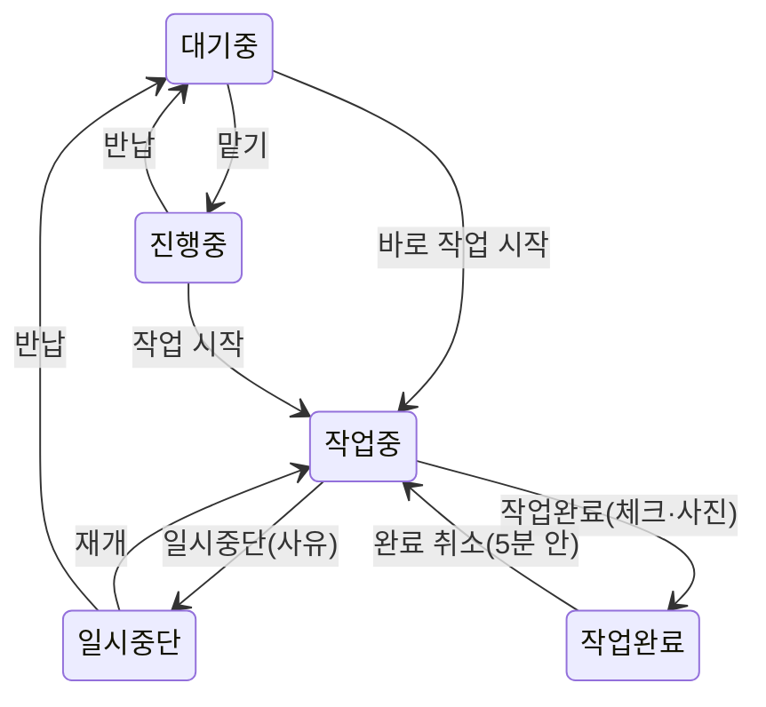

# FieldSync 사용 설명서 (USER_GUIDE.md)

> 대상: 작업자 · 팀장 · 관리자 · 기준 앱 버전 1.0.0
> 표기: 대괄호 [ ]는 앱 화면의 버튼·메뉴 이름입니다(한국어 화면 기준). 영어·베트남어 화면도 같은 위치에 있습니다.

## 1. 이 앱으로 하는 일

- 관리자가 보낸 **동선(현장 묶음)** 을 지도와 목록으로 봅니다.
- 현장을 **맡으면** 다른 사람에게 즉시 "누가 하는 중"으로 보여, 같은 번지를 두 번 작업하지 않습니다.
- 상하수도 **체크 항목·사진·서명**을 남기고 **작업완료**를 누르면 기록이 남습니다. 완료를 잊으면 앱이 알려 줍니다.

## 2. 시작하기

1. 관리자에게 **로그인 ID와 초기 비밀번호**를 받습니다. 앱에서는 가입할 수 없습니다.
2. 앱을 열고 화면 위쪽에서 언어(한국어·English·Tiếng Việt)를 고른 뒤 ID·비밀번호를 넣고 [로그인]을 누릅니다.
3. 처음 로그인하면 **알림**과 **위치(앱 사용 중)** 권한을 묻습니다. 둘 다 허용해야 완료 알림과 도착 확인이 동작합니다([배터리 절약 모드]를 켜 두면 위치는 묻지 않습니다). 사진을 처음 찍을 때는 카메라 권한을 묻습니다.
4. `사용이 중지된 계정입니다`가 나오거나, 맞게 입력했는데도 `ID 또는 비밀번호가 올바르지 않습니다`가 계속 나오면 계정이 중지됐을 수 있습니다. 관리자에게 문의하세요.

## 3. 화면 구성

| 위치 | 내용 |
|---|---|
| 맨 위 | 동선 이름(눌러서 다른 동선 선택) · 🔔 [알림함] · [목록 보기]/[지도 보기] 전환 |
| 알림 띠 | 앱 업데이트 필요 · 오프라인/전송 대기 · 긴급 요청(빨간 띠) |
| 필터 칩 | [전체] · 상태별 · [내 작업] — 칩마다 현장 수가 실시간으로 표시됩니다 |
| 가운데 | 지도(상태별 색 마커) 또는 목록. 목록 순서는 내 현장 → 대기 현장 → 나머지 |
| 맨 아래 | **현재 작업 바**: 작업중이면 경과 시간과 [일시중단] [작업완료] 버튼 |
| ☰ 메뉴 | [작업 기록] · [통계]* · [긴급 요청 보내기]* · [카카오맵 즐겨찾기 열기]** · [관리]* · [설정] (*권한이 있을 때만, **동선에 링크가 있을 때만) |

현장을 누르면 **상세 화면**이 열립니다.

- 번지·도로명을 한 번 누르면 **복사**되고 진동과 함께 `복사됨`이 표시됩니다. 문자·메신저에 바로 붙여 넣을 수 있습니다.
- [길찾기]는 카카오맵 앱에서 현재 위치 → 현장 길안내를 엽니다(앱이 없으면 웹, 현재 위치를 모르면 현장 지도만). [카카오맵에서 보기]도 있습니다.
- 아래쪽에 체크 항목 진행 상황과 [최근 기록]이 보입니다.

## 4. 상태 표기

색 + 글자 + 아이콘으로 구분하므로 색을 구별하기 어려워도 읽을 수 있습니다.

| 상태 | 색 | 뜻 |
|---|---|---|
| [대기중] | 회색 `#616161` | 아무도 맡지 않음 — 맡을 수 있음 |
| [진행중] | 파랑 `#1565C0` | 누군가 맡고 이동 중(아직 작업 전) |
| [작업중] | 빨강 `#C62828` | 작업하는 중 — **1초 간격으로 깜빡임** |
| [일시중단] | 노랑 `#F9A825` | 잠시 멈춤(사유 기록). 다른 사람은 맡을 수 없음 |
| [작업완료] | 초록 `#2E7D32` | 끝남(완료 시각 표시) |

- 구름 아이콘이 붙은 칩은 **아직 서버로 보내지 못한 내 조작**입니다(오프라인). 연결되면 자동으로 사라집니다.
- 깜빡임은 폰의 "동작 줄이기" 설정이나 앱의 [배터리 절약 모드]를 켜면 멈춥니다.

## 5. 작업 순서 (작업자)



1. **맡기** — 상세 화면에서 [맡기 (진행중)]을 누릅니다. 현장에 이미 도착했다면 [바로 작업 시작]을 눌러도 됩니다.
   - 다른 사람이 먼저 잡았다면 `김철수님(1팀)이 09:12부터 작업중`처럼 누가 하고 있는지 알려 줍니다.
   - 한 사람이 동시에 잡을 수 있는 현장은 기본 **3곳**, 그중 [작업중]은 **1곳**뿐입니다.
   - 다른 팀에 배정된 동선은 보기만 할 수 있고, 맡으면 `다른 팀에 배정된 현장입니다`가 뜹니다.
   - 실수로 맡았다면 맡은 직후 화면 아래에 몇 초간 뜨는 안내의 [반납]을 누르면 바로 취소됩니다(온라인일 때, 사유: 잘못 맡음(취소)). 놓쳤다면 상세 화면의 [반납]을 쓰세요.
2. **도착** — 현장 50m 안에 들어가면 `작업을 시작할까요? (작업중)` 확인창이 뜹니다. 맡은 현장이 없으면 `이 현장을 맡을까요? (진행중)`이 뜹니다. 자동으로 바뀌지는 않고, [작업 시작](또는 [맡기])과 [나중에] 중에서 직접 고릅니다. 같은 현장에서는 10분에 한 번만 묻습니다.
3. **작업 시작** — [작업 시작]을 누르면 [작업중]이 되고 하단 작업 바에 경과 시간이 흐릅니다.
4. **잠시 멈춤** — [일시중단]을 누르고 사유를 고릅니다: 주민 부재 · 자재 부족 · 접근 불가 · 기상 악화 · 기타(메모 입력). 돌아오면 [재개]를 누릅니다.
5. **작업완료** — [작업완료]를 누르면 완료 화면이 열립니다.
   - 체크 항목(예: 계량기 확인 예/아니오, 누수 여부, 지침 숫자)을 채웁니다. `*` 표시는 필수입니다.
   - [사진 추가]로 [카메라] 또는 [앨범]에서 사진을 넣습니다. 사진을 추가한 시각과 그때의 위치가 함께 기록되고, 필요한 장수는 동선마다 다릅니다(기본 1장).
   - 서명이 필요한 동선은 서명란에 그리고 [서명 저장]을 누릅니다. [작업완료 제출] 때 그려 둔 서명은 자동 저장됩니다.
   - 빠진 것이 있으면 빨간 상자에 `누락: 맨홀 상태, 사진 1장 더`처럼 표시되고, 다 채우면 [작업완료 제출]이 눌립니다.
   - 중간에 나가야 하면 [임시 저장]을 누르세요.
6. **완료 취소** — 잘못 눌렀다면 완료 후 **5분 안에** 상세 화면의 [완료 취소]로 [작업중]으로 되돌릴 수 있습니다.
7. **반납** — 못 하게 된 현장은 [반납]과 사유(예: 일정 변경)를 입력하면 다시 [대기중]이 됩니다.

## 6. 알림

| 상황 | 언제 | 알림 내용 |
|---|---|---|
| 작업완료를 안 누름 | 작업 시작 **90분** 뒤 첫 알림, 이후 **30분**마다(최대 **8회**) | `○○ 완료 체크하셨나요?` |
| 팀장 보고 | 위 알림의 **3번째** 때 팀장에게(팀장이 없으면 관리자) | "완료 체크 지연" |
| 맡고 시작 안 함 | 맡은 뒤 **45분**마다 | `○○ 작업을 시작하셨나요?` |
| 일시중단이 길어짐 | **4시간**마다 | `○○ 일시중단 중` |
| 긴급 요청 · 강제 해제 · 재오픈 · 새 동선 배포 | 즉시 | 원격 푸시 |

- 완료 알림의 [작업완료] 버튼이나 알림 자체를 누르면 해당 현장 상세가 열립니다(거기서 [작업완료]). [30분 뒤] 버튼은 앱을 연 뒤 알림을 30분 미룹니다.
- 현장 상세 화면의 [알림 연기]에서 [10분 뒤] · [30분 뒤] · [1시간 뒤] · [직접 설정(시·분)] 중 고를 수 있습니다(5분~8시간).
- Android에서는 작업중인 동안 알림창에 `작업중 · 번지`가 고정되어 경과 시간이 보입니다.
- 🔔 [알림함]에는 서버가 보낸 알림(긴급 요청·강제 해제·재오픈·새 동선 배포·팀장 보고)이 쌓이고, 누르면 해당 현장이 열립니다. 완료 체크 리마인더는 폰이 직접 울리는 알림이라 알림함에는 남지 않습니다.
- 시간 값은 관리자가 바꿀 수 있습니다(§8).

## 7. 인터넷이 끊겼을 때

- 위쪽에 `오프라인 · 전송 대기 3건 (탭하면 재시도)` 띠가 뜹니다. 맡기·시작·일시중단·완료·사진은 **폰에 저장**됐다가, 연결되면 **누른 순서대로 자동 전송**됩니다.
- 오프라인에서 [맡기]를 누르면 다른 사람과 겹칠 수 있다고 경고합니다. 연결 후 **먼저 서버에 도착한 사람**이 맡게 되고, 늦은 쪽에는 점유자 안내가 뜹니다.
- 전송 대기 중에 [로그아웃]하면 보내지 못한 요청과 사진이 삭제되므로(다른 계정으로 잘못 전송되지 않도록) 앱이 한 번 더 확인합니다.
- 서버에 전송된 작업의 완료 알림은 폰에 예약되어 있어 오프라인이어도 울립니다. 오프라인에서 새로 맡거나 시작한 작업은 연결되어 전송된 뒤부터 예약됩니다.

## 8. 기본 정책 (관리자가 [알림·점유 정책]에서 변경)

| 항목 | 설정 키 | 기본값 | 바꿀 수 있는 범위 |
|---|---|---|---|
| 작업 시작 후 첫 알림 | `remind_working_first_min` | 90분 | 5분 ~ 24시간 |
| 반복 간격 | `remind_working_repeat_min` | 30분 | 5분 ~ 24시간 |
| 최대 알림 횟수 | `remind_max` | 8회 | 1 ~ 20회 |
| 팀장 보고 회차 | `escalate_at` | 3번째 | 1 ~ 20 |
| 맡기 후 미시작 알림 | `remind_en_route_after_min` | 45분 | 5분 ~ 24시간 |
| 일시중단 장기화 알림 | `remind_paused_after_min` | 240분(4시간) | 5분 ~ 48시간 |
| 1인 동시 점유 한도 | `max_claims_per_user` | 3곳 | 1 ~ 20곳 |
| 도착 감지 반경 | `arrive_radius_m` | 50m | 10 ~ 500m |
| 완료 취소 가능 시간 | `undo_complete_window_min` | 5분 | 0 ~ 60분 |
| 최소 앱 버전 | `min_app_version` | 1.0.0 | 이보다 낮으면 업데이트 안내 |

## 9. 그 밖의 기능

- **긴급 요청**(팀장·관리자, 권한 `긴급 요청 발송`)
  - ☰ [긴급 요청 보내기] 또는 현장 상세의 [이 현장 긴급 요청]에서 내용을 입력하면 모든 사용자에게 푸시가 가고, 화면 위에 빨간 띠가 뜹니다.
  - 처리한 뒤 빨간 띠를 누르고 [해결 처리]를 고르면 띠가 사라집니다. [현장 보기]로 해당 현장을 열 수도 있습니다.
- **작업 기록**(☰ [작업 기록])
  - 누가·언제·어디서·무엇을 했는지 [오늘] · [7일] · [전체]로 봅니다. [더 보기]로 이전 기록을 불러옵니다.
  - 작업자는 본인 기록만, 팀장은 권한이 있으면 팀 기록, 관리자는 전체를 봅니다.
  - 현장 좌표에서 200m 넘게 떨어진 곳에서 누른 조작은 `현장에서 350m 떨어진 위치`처럼 표시됩니다. 단말 시각과 서버 기록 시각이 2분 이상 다르면(오프라인에서 누른 조작 등) 단말 시각이 함께 보입니다. 거절된 시도(중복 맡기 등)도 [거절]로 남습니다.
- **통계**(관리자, 팀장은 권한 `팀 통계 조회`): [팀별]/[개인별]로 완료율·평균 작업 시간·반납 수·차단된 중복 시도·장기 미완료를 봅니다.
- **설정**(☰ [설정])
  - [화면 테마]: [시스템] · [밝게] · [어둡게] · [야외](직사광선용 고대비)
  - [언어], [글자 크기]: [보통] · [크게] · [아주 크게]
  - [배터리 절약 모드]: 위치 확인·깜빡임을 끄고, 백그라운드에서 연결을 해제하며, 기본 화면이 목록이 됩니다.
  - [가까운 순 정렬]: 대기 현장을 현재 위치에서 출발해 매번 가장 가까운 다음 현장을 잇는 동선 순서로 보여 줍니다.
  - [알림 테스트], [로그아웃]

## 10. 관리자·팀장 기능 (☰ [관리])

### 10.1 동선 만들기와 배포

1. [동선(현장 묶음)] → [새 동선] → [이름], [작업일(YYYY-MM-DD)], [배정 팀](비우면 [전체 팀]), [체크 템플릿], [카카오맵 즐겨찾기 공유 링크(참고)]를 입력하고 오른쪽 위 저장 아이콘([저장])을 누릅니다.
2. 현장을 넣습니다.
   - [주소 검색 추가]: `성수동1가 685-12`처럼 검색하고 결과를 고른 뒤, 필요하면 [세부(동·계량기, 선택)]을 입력합니다.
   - [CSV 업로드]: 아래 10.2 형식으로 여러 곳을 한 번에 넣습니다.
   - 같은 번지+세부가 이미 활성(완료 전) 상태로 있으면 중복으로 거절됩니다.
3. 목록을 끌어서 방문 순서를 바꿉니다. 필요 없는 현장은 [현장 보관(목록에서 제외)]합니다.
4. **[배포(작업자에게 전달)]** 스위치를 켜면 작업자 지도에 나타나고 배정 팀에 알림이 갑니다. 배포와 배포 회수는 **관리자만** 할 수 있습니다. 팀장은 초안 동선을 만들고 현장을 넣을 수 있으며, 배포된 동선은 팀장에게 읽기 전용입니다(수정은 관리자만).

> 카카오맵 즐겨찾기 폴더의 주소를 앱으로 자동으로 가져올 수는 없습니다(카카오가 공개 API를 제공하지 않음). 공유 링크는 작업자가 ☰ [카카오맵 즐겨찾기 열기]로 참고용으로 여는 데 쓰입니다.

### 10.2 CSV 형식

- 엑셀에서 **"CSV UTF-8(쉼표로 분리)"** 로 저장해야 합니다. 일반 CSV(한글 깨짐)를 올리면 `CSV UTF-8 형식이 아닙니다`가 표시됩니다.
- 첫 줄은 제목 줄입니다. **주소 열은 필수**이고 나머지는 선택입니다. 열 순서는 자유입니다.

| 열 제목(아무거나 하나) | 내용 | 최대 길이 |
|---|---|---|
| `주소` / `address` | 지번 주소(번지까지 정확히) | 200자 |
| `구분` / `라벨` / `이름` / `label` | 현장 표시 이름 | 50자 |
| `세부` / `상세` / `unit` | 동·계량기 번호 등 | 100자 |
| `메모` / `비고` / `memo` / `note` | 작업자에게 보일 메모 | 500자 |

예시(3곳 — 세 번째는 구분 없이, 메모에 쉼표가 있어 큰따옴표로 감쌈):

```csv
구분,주소,세부,메모
A-1,서울 성동구 성수동1가 685-12,,정문 옆 계량기
A-2,서울 성동구 성수동1가 686-3,B동 계량기#2,
,서울 성동구 성수동1가 690-1,,"주차장 안쪽, 경비실 문의"
```

- 한 번에 최대 **1,000행**(파일 약 1MB 이하)까지 올릴 수 있습니다. 빈 줄은 건너뛰고, 행 번호는 엑셀 행 번호와 같습니다.
- 결과 창에는 `12곳 등록`과 함께 **중복**(같은 파일 안 또는 이미 등록된 활성 현장)과 **실패**(주소를 찾을 수 없음, 후보가 여러 개 — 번지까지 정확히)가 행 번호와 함께 표시됩니다. 실패한 행만 고쳐서 다시 올리면 됩니다.

### 10.3 사용자·권한·템플릿

- **[사용자·등급]**
  - [계정 발급]: 로그인 ID(영문 소문자·숫자·_.- 3~32자), [이름], [초기 비밀번호](8자 이상), [등급], [배정 팀]을 입력합니다.
  - 각 사용자 메뉴에서 [등급·팀 변경] · [비밀번호 초기화] · [사용 중지]/[사용 재개]를 할 수 있습니다. [팀 추가]도 여기서 합니다.
  - 현장을 맡고 있는 사람은 사용 중지할 수 없습니다. 먼저 [강제 해제]하세요.
  - 마지막 관리자는 강등하거나 중지할 수 없습니다.
- **[권한]**: 팀장·작업자에게 줄 권한을 켜고 끕니다.
  - 켜고 끌 수 있는 권한: 현장 등록 · 현장 수정 · 강제 해제(팀) · 재오픈(팀) · 긴급 요청 발송 · 팀 로그 조회 · 팀 통계 조회 · 체크 템플릿 편집
  - 관리자만 가능(바꿀 수 없음): 배포 · 등급·권한 부여 · 계정 관리 · 정책 변경
- **[체크 템플릿]**: 상하수도 점검 항목을 만듭니다.
  - 항목 종류: [예/아니오] · [선택](선택지를 쉼표로 구분) · [숫자](단위·최소·최대) · [글]
  - [필수] 여부, [구분(상수도/하수도)], 필수 사진 장수, [서명 필수]를 정할 수 있습니다.
- **[알림·점유 정책]**: §8의 값을 시간·분으로 입력해 저장합니다. 범위를 벗어나면 저장되지 않습니다.
- **강제 해제 · 재오픈**(현장 상세)
  - 연락이 안 되는 사람이 잡고 있는 현장은 [강제 해제]하고 사유를 입력합니다. 대상자에게 알림이 갑니다.
  - 다시 해야 하는 완료 현장은 [재오픈]하면 [대기중]으로 돌아갑니다.
  - 팀장은 해당 권한이 있을 때 **자기 팀원이 맡은(맡았던) 현장**만 할 수 있습니다. 다른 팀 현장은 `권한이 없습니다`가 뜹니다.

## 11. 문제 해결

| 증상 | 해결 |
|---|---|
| `ID 또는 비밀번호가 올바르지 않습니다` | ID는 대소문자를 구분하지 않습니다. 계속되면 관리자에게 [비밀번호 초기화]를 요청하세요(계정이 중지된 경우에도 이 메시지가 나옵니다) |
| 지도가 안 보임 | [목록 보기]로 전환해 계속 작업할 수 있습니다. 관리자에게 알려 주세요(카카오 키 설정) |
| 완료 알림이 안 옴 | [설정] → [알림 테스트]. 안 오면 폰 설정에서 앱 알림을 허용하고, Android는 배터리 최적화에서 앱을 제외하세요 |
| 도착 확인창이 안 뜸 | 위치 권한(앱 사용 중)을 허용했는지, [배터리 절약 모드]가 꺼져 있는지 확인하세요 |
| `작업중인 다른 현장을 먼저 완료하거나 일시중단하세요` | 작업중인 현장은 1곳뿐입니다. 하단 작업 바의 현장을 먼저 마치세요 |
| `동시에 맡을 수 있는 현장 수를 넘었습니다` | 맡아 둔 현장 중 하나를 시작하거나 [반납]하세요 |
| `완료 취소 가능 시간이 지났습니다` | 팀장·관리자에게 [재오픈]을 요청하세요 |
| `증빙을 올릴 작업이 없습니다(점유 해제됨)` | 오프라인 중에 현장이 해제됐습니다. 팀장에게 확인하세요 |
| 앱 위쪽에 `앱 업데이트가 필요합니다` | 스토어에서 앱을 업데이트하세요 |
